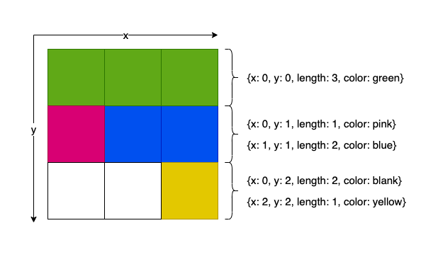

# Smol Joes

Set of contracts used to upgrade, sell and generate metadata for the Smol Joes (The Expansion) NFT collection.

Main features:
-   Fully on-chain metadata and image generation.
-   Burn former Smol Joes and Smol Creeps NFTs to upgrade to the new collection.
-   Burn NFT tokens sold on Launchpegs to mint randomly generated Smol Joes.
-   Multichain support: buy and bridge the NFTs bewteen different chains.

## Metadata generation

Metadata and images for the Smol Joes collection are fully generated on chain, based on the method used by the [Nouns NFT collection](https://github.com/nounsDAO/nouns-monorepo/) on Ethereum. This method allows to greatly compress the initial images to lower the cost of uploading them into the blockchain, using `Run-length encoding` (RLE). Note that this method is only suited for pixel art.

### RLE encoding

Instead of storing each pixel individually, which would take `{x, y, color} = 5 bytes` of data, each image is deconstructed in rectangles of the same color. Each rectangle being described by `{x, y, length, color} = 6 bytes`. If we take a 9x9 example (Smol Joes images are 45x45) :



Here, instead of storing `9 * 5 = 45 bytes` of data, we do `5 * 6 = 30 bytes`. This optimization is particularly suited for images that have large parts of the same color.

As a further optimization, colors, that take `3 bytes` to be stored as RGB, are not stored in each individual rectangle, but instead in a `color palette`, i.e. a list of every color used. Each rectangle will now hold the color position in the palette, instead of the color itself. Since Smol Joes have ~12k different colors, the index is stored in `2 bytes` (instead of 3 for the full RGB).

Smol Joes images have been encoded using a script forked from the Nouns repository, that can be found [here](https://github.com/Mathieu-Be/nouns-monorepo/blob/master/packages/nouns-assets/scripts/encode.ts). After encoding, the bytes arrays are then compressed.

### Image reconstruction

To reconstruct the final image, different contracts will be used, following this architecture:


**Descriptor**: This is the main point of entry. The Smol Joes contract will request the `tokenURI` from the descriptor.\
**Art**: This contract will manage the uploaded images. Each group of images is called a `page` and will be stored in contract bytecode using Solady's `SSTORE2`. The contract is controlled by the `Descriptor`.\
**Seeder**: This contract is responsible of randomly generating combinations of the uploaded art when a new token is minted.\
**Inflator**: This contract decompress the data stored in the `pages`.\
**SVG Renderer**: This contract will take every part of the token `seed` and convert the corresponding RLE encoded images into SVG `rectangles`.\
**NFT Descriptor**: This contract will take the SVG image, encode it into a `base64` string, add the rest of the metadata and then encode again to `base64`. This is what will be returned by `tokenURI()`.

There is three different types of Smol Joes that can be built:
- Originals: Ugraded Smol Joe V1. Each V1 token will have it's corresponding Original, described by the `_getOriginalsArtMapping` function (set by the owner). There is only one corresponding `Trait` that contains the full image.
- Luminaries: Upgraded unique Smol Creep. Each token will be randomly assigned when the V1 is burned. Each Luminary can be assigned once of course, so the `_luminariesAvailable` array have been introduced. There is only one corresponding `Trait` that contains the full image. Each Luminary also belong to one of the 10 Brotherhood (see the `Brotherhood` enum in `ISmolJoeArt`).
- Smol: Rest of the collection. Can be generated infinitely. Each Smol image is the superposition of the following traits: Background, Body, Shoes, Pants, Shirt, Beard, Hair/Cap/Head, Eye accessory, Accessory. First, a random Brotherhood will be assigned to the token. Then, one asset of each trait type will be picked ***within this brotherhood***. The final image will be the superposition of all the assets.

## Testing

This project uses both `Hardhat` and `Foundry`. Tests are using Foundry.

`GenerateSVG.t.sol` can be used to test the SVG generation during development. To run the test in this contract, set the `FOUNDRY_PROFILE` env variable to `svgtesting`:

```
export FOUNDRY_PROFILE=svgtesting
```